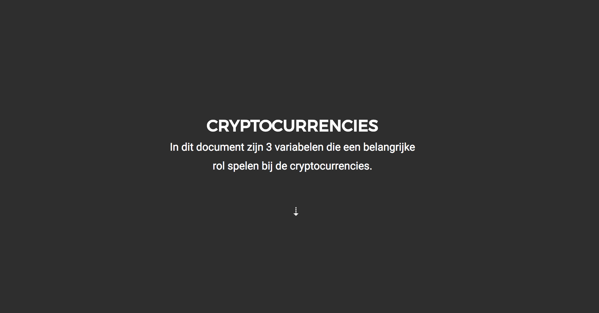

# Information Design Opdracht A


Een school project met het hoofdonderwerp de top 10 cryptocurrencies.

## Beschrijving
In deze opdracht heb ik 3 inzichten verwerkt en met de d3 library gewerkt.
Hierin wordt data opgeschoont en de data staat op de juiste plek.

## Achtergrond
Dit is een data-visualizatie over de top-10 cryptocurrencies, hierin kun je zien wat ze waard zijn,
hoegroot de markt voor hun is, en hoe de prijs veranderd in de afgelopen 24 uur.

## Process
Eerst ben ik gaan zoeken naar een leuk onderwerp, die ik via [kaggle](https://www.kaggle.com/datasets)
en ik kwam uit op een hededaagse trend [Top 100 Cryptocurrency Historical Data](www.coinmarketcap.com)
Daarna ben ik gaan welke data ik wilde gebruiken en welke inzichten ik eruit kon halen.
Vervolgens ben ik grafieken gaan maken met de onderwerpen die ik heb gebruikt.

## Directory
```
Directory.
|
|-- css
|   |-- style.css 
|
|-- scripts/
|   |-- d3.js
|
|-- data/
|   |-- top100.csv
|
|-- index.html
|-- Readme.md
```
## Data cleaning
Hiermee pak ik de dataset en vervang ik al de overbodige tekens.
Met de data.sort functie zorg ik ervoor dat er numbers terug worden gestuurd.
``` Javascript
d3.csv("data/top100.csv", function(data) {
      data.Price = data.Price.replace('$', '')
      data.Price = data.Price.replace(',', '')
      data.MarketCap = data.MarketCap.replace('$', '')
      data.MarketCap =+ data.MarketCap.replace(/,/g, '')
      data.Change24h =+ data.Change24h.replace('%', '')
  return data;
}, function(error, data) {
  if (error) throw error;

    // Zorgt ervoor dat je de descended waardes krijg.
    data = data.sort(function(a, b){
      return parseFloat(b.Price) - parseFloat(a.Price);
    });

    // pakt de top 10.
    data = data.splice(0,10)
```
## Features
* d3-request — d3.csv — Loading files
* d3-scale — d3.scaleOrdinal — Position encodings
* d3-selection — d3.select — Select elements

## Sources
  https://bl.ocks.org/mbostock/3885304 - Mike Bostock’s
  https://bl.ocks.org/ch-bu/f3d1fc6e905f80b0706663fbefe317bc - Christian Burkhart’s
  https://bl.ocks.org/alandunning/7008d0332cc28a826b37b3cf6e7bd998 - Alan Dunning’s
  
### License
* Alle rechten behoren bij [Mike Bostock](https://bl.ocks.org/mbostock/3885304),
* [D3](https://d3js.org/)
* [Alan Dunning's](https://bl.ocks.org/alandunning/7008d0332cc28a826b37b3cf6e7bd998) 
* [Kaggle](https://www.kaggle.com/natehenderson/top-100-cryptocurrency-historical-data)

MIT © Sam Guliker

